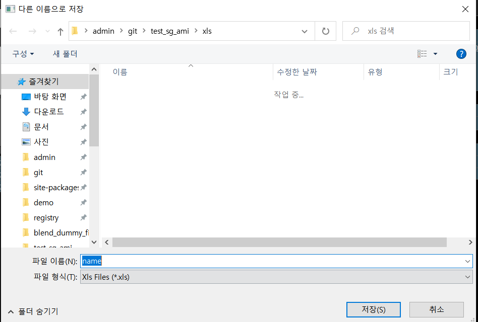
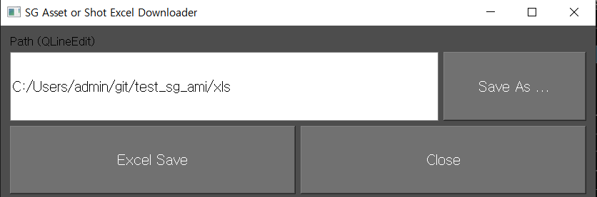

# sg_ami_excel_creator

* start date : 2023.04.25 (화)

* 완료 : 2023.04.27 (목)

***

샷그리드의 Asset or Shot 페이지에서 Excel 로 Export 할것들을 선택하고 Ami(액션매뉴아이템)에 커스텀 프로토콜(레지스트리) 환경을 셋팅하여 사용한다.

***
## How to use

1. shotgrid 에서 해당 ami 를 선택한다.
2. main ui 가 뜬다.
3. Save as 버튼을 클릭하여 저장할 Excel 파일 경로와 이름을 정한다.
4. main ui 에 저장하는 경로가 셋팅된다.
5. Excel Save 버튼을 누르면 유저가 선택한 asset or shot 의 정보가 Excel 파일에 저장된다.
6. Close 버튼을 누르면 ui가 종료된다.
***
## UI
#### 
* shotgrid ami

 
* main ui

* save as btn

* path

* create excel

* Excel check

